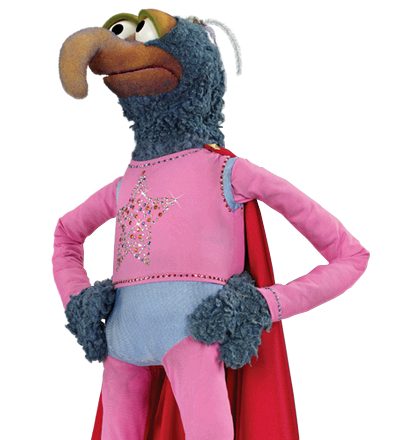

# Andy's User Page

## Index
[About Me]()
[What I Look Like]()
[Programming Languages I Am Familiar With In A Numbered But Meaningless Order]()
[Links]()

## About Me
My name is Andrija Šunjić, I go by **Andy**. I was born in Mostar, SR Bosnia and Herzegovina, SFR Yugoslavia. It's a long name for a little place. I am currently studying Computer Science at University of California, San Diego.

Here is a quote I found by typing "Oscar Wilde" into google:
>Experience is simply the name we give our mistakes.

## What I Look Like


## Programming Languages I Am Familiar With In A Numbered But Meaningless Order
1. Java:       ```System.out.println("Hello, world!");```
2. C:          ```printf("Hello, world!");```
3. Python:     ```print "Hello, world!"```
4. JavaScript: ```document.write('Hello, world!');```

## Links
- [E-Mail](asunjic@ucsd.edu)
- [LinkedIn](www.linkedin.com/in/andrija-sunjic)
- [GitHub](https://github.com/andrija-s)